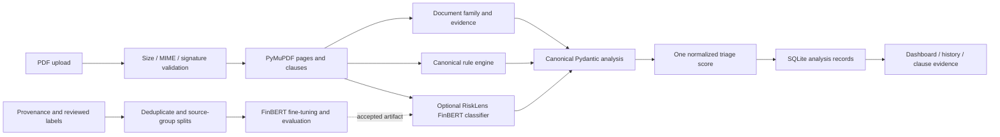

# RiskLens AI

Explainable financial and insurance agreement triage: upload a text-readable PDF,
inspect page-linked clause evidence, review a consistent 0–100 risk score and
reopen the analysis from a local dashboard.

**Honest model status:** this repository provides a domain-specific FinBERT
training/deployment pipeline, but ships **no trained RiskLens classifier**.
Without an accepted artifact, the application clearly displays **Rule-only
analysis / AI classifier unavailable**. Rules do not return ML probabilities.
The prototype's discarded service results, fake confidence, duplicate scorers,
sentiment-driven risk score and duplicate inline frontend were replaced.

## Why it exists

Financial and insurance agreements bury important costs, restrictions and rights
in dense text. RiskLens makes evidence inspectable rather than presenting an
unexplained answer. It supports loan, credit-card, insurance, investment, lease,
other-financial and unknown document types, using a documented heuristic
classification strength rather than a fabricated probability.

The same canonical schema connects secure extraction, document classification,
optional domain-model inference, negation-aware rules, hybrid scoring, summaries,
SQLite persistence and a fully interactive vanilla dashboard.



## Installation

Python **3.11 or newer**; Python 3.12 was verified. A GPU is optional. No external
API key or database server is required for rule-only operation.

```bash
python3 -m venv .venv
source .venv/bin/activate
# Optional CPU-only PyTorch: avoids installing unused CUDA libraries.
pip install torch --index-url https://download.pytorch.org/whl/cpu
pip install -r requirements-dev.txt
pytest
uvicorn backend.main:app --reload --host 127.0.0.1 --port 8000
```

`requirements.txt` contains only constrained runtime dependencies;
`requirements-dev.txt` adds pytest, HTTPX and Ruff. For a GPU machine install the
appropriate officially supported PyTorch build instead of the CPU command.
Dependencies are bounded by major versions; the verified versions are recorded
in [VERIFICATION](docs/VERIFICATION.md). Keep TLS/checksum verification enabled.

The backend serves the frontend at `/` and assets at `/static/`; there is no
separate frontend build or framework. Use the server address in your own local
browser. Empty workspaces show actual empty states, not demo statistics.

## Configuration

| Variable | Default / purpose |
| --- | --- |
| `RISKLENS_DB_PATH` | `risklens.db` in the checkout; override for tests or local storage |
| `RISKLENS_MODEL_PATH` | No default; local accepted RiskLens-trained artifact directory |
| `RISKLENS_MODEL_ID` | Optional Hugging Face artifact ID when no local path is set |
| `SEC_USER_AGENT` | Genuine organization/contact required only for SEC source ingestion |
| `HF_HUB_OFFLINE` | Optional standard Hugging Face offline mode for cached artifacts |

A model must use all ten canonical labels, correct inverse mappings and matching
RiskLens deployment metadata. Vanilla FinBERT sentiment is rejected. Load errors
are reported, not silently substituted. Inference errors produce explicit
rule-only results for that analysis. Review real evaluation before deployment.

## Supported risks

The authoritative [taxonomy](backend/taxonomy.json) defines descriptions,
severities, scoring weights, rule patterns, explanations, recommendations and
legacy aliases for:

`hidden_charges`, `high_interest`, `penalty_clause`, `foreclosure`,
`automatic_renewal`, `coverage_exclusion`, `waiting_period`, `unilateral_change`,
`other_risk`, `no_risk`.

Rules recognize explicit evidence and suppress negated/protective terms. Merely
mentioning an interest rate or APR is not high interest. Rule outputs include the
matched phrase, pattern, rule ID and offsets; `model_confidence` is null without
model inference. A deployed classifier returns its genuine softmax distribution.
Disagreement between model and rules remains visible. The default accepted-model
threshold is 0.65, a policy choice rather than empirically calibrated accuracy.

## PDF workflow and dashboard

1. Choose/drop a text-readable PDF (maximum 20 MiB, 500 pages).
2. Validation checks MIME, extension, signature, parser integrity and encryption.
   Scanned/image-only PDFs receive a clear OCR-unavailable error.
3. Extraction keeps page references and clause source offsets; analysis runs
   outside the asynchronous event loop with bounded text/clause work.
4. Inspect mode/model version, score, category/severity charts, evidence cards,
   document health, executive summary and class-specific review actions.
5. Search/filter clauses by text, severity or detection method; expand a clause
   for its full text, model distribution, matched rule and recommendation.
6. Reopen stored analyses from document history, or delete their stored records.

Charts, counts, activity and summaries come from actual API results. All rectangular
UI border radii are **0**; circular gauges are SVG. The interface includes semantic
landmarks, keyboard controls, focus states, labeled fields, loading/errors,
responsive layouts and reduced-motion support.

## Scoring and health

One documented triage heuristic combines severity weight, actual accepted-model
probability, explicit rules, agreement and unique material-category diversity.
It retains only the strongest contribution per category, so repeating findings
or uploading a longer document does not automatically produce 100. Sentiment is
not part of the score. Rule evidence strengths are heuristics, not probabilities.

Interpretation: **0–29 Low; 30–59 Moderate; 60–79 High; 80–100 Critical**.
See [RISK_SCORING](docs/RISK_SCORING.md) for the exact formula and all health
indicator definitions. A no-finding clause is not certified legally or financially
safe. Extraction quality means text-bearing page ratio, not transcription accuracy.

## Data, training and evaluation

The **single** pipeline is under `training_pipeline/`. It records observed source
URLs, organization, retrieval timestamp, source-document SHA256, annotation
method and hard-negative status. Use official CFPB agreements, public insurer /
IRDAI policy wording and relevant SEC exhibits. CUAD categories require explicit
semantic review; they are never blindly relabeled as RiskLens risks.

The 2,857 prototype card labels are **weak regex supervision**, now quarantined.
Two historical human-review claims lack document/reviewer provenance. Neither is
production ground truth. Twenty-one clearly synthetic challenge fixtures include
12 hard negatives and cannot replace a real evaluation set. Eligible real
training examples currently number zero. No model accuracy/F1 is claimed.

```bash
# Restore verified, pinned upstream CUAD (not RiskLens-labeled training data):
python -m training_pipeline.ingestion.cuad
# Collect actual approved PDFs from a manifest of observed source URLs:
python -m training_pipeline.ingestion.public_sources --manifest sources.json --output training_pipeline/data/raw/collection
# Manually review/annotate candidates; preserve actual provenance, then:
python -m training_pipeline.preprocessing.prepare --input reviewed.jsonl --output training_pipeline/data/processed/v1
python -m training_pipeline.scripts.train --data-dir training_pipeline/data/processed/v1 --output training_pipeline/artifacts/v1 --epochs 8 --batch-size 8 --learning-rate 2e-5 --seed 42
python -m training_pipeline.scripts.evaluate --model training_pipeline/artifacts/v1 --data-dir training_pipeline/data/processed/v1 --output training_pipeline/artifacts/v1/evaluation
```

Normalization and duplicate clustering happen **before source-document-grouped**
70/15/15 target splits. Cross-split source/near-duplicate leakage fails validation.
Evaluation data is never oversampled. The trainer fails clearly when eligible
class counts are insufficient or synthetic data dominates evaluation.

FinBERT's head is reinitialized for the domain taxonomy. Training uses class
weights, deterministic seeds, early stopping, validation selection, linear LR
scheduling and CPU/GPU support. See [MODEL](docs/MODEL.md) for thresholds and
metadata. Genuine evaluation produces `metrics.json`, `classification_report.json`,
`confusion_matrix.json`, `confusion_matrix.png` and `errors.jsonl`. No weights or
large downloaded corpora are added to normal Git history.

## API and persistence

| Endpoint | Purpose |
| --- | --- |
| `GET /api/health` | Service/database/frontend readiness and current mode |
| `GET /api/system/model` | Actual model availability, mappings, version and device |
| `GET /api/system/taxonomy` | Authoritative display names and evidence policy |
| `POST /api/analyze` | Multipart PDF → canonical `AnalysisResult` |
| `POST /api/review` | Retained upload alias |
| `GET /api/dashboard` | Actual aggregate statistics and recent analyses |
| `GET /api/documents?limit=20&offset=0` | Paginated history |
| `GET /api/documents/{id}` | Full stored canonical analysis |
| `GET /api/dashboard/documents/{id}` | Retained detail alias |
| `DELETE /api/documents/{id}` | Delete analysis and clauses |

OpenAPI documentation is available at `/docs`. SQLite stores versioned canonical
results and clause evidence transactionally. Additive migration preserves old
risklens.db identifiers/records; legacy results are marked unverified and their
old fabricated confidence is not presented as model inference. Existing unrelated
fintel.db data is not overwritten or deleted. See [ARCHITECTURE](docs/ARCHITECTURE.md).

## Project structure

```text
backend/                 schemas, taxonomy, one database store and API
  services/              extraction, classifier, model loader, rules, scorer
frontend/                semantic HTML and square-corner CSS
  js/                    API, dashboard, evidence, SVG charts, safe DOM utilities
training_pipeline/
  ingestion/             authorized source/PDF and checksum-verified CUAD tools
  annotation/            legacy quarantine, weak labels, synthetic challenge cases
  preprocessing/         metadata validation, normalization, clustering/group splits
  evaluation/            genuine classification metrics and confusion-matrix plot
  scripts/               one trainer, evaluator and model prediction CLI
  data/manifests/        source/checksum manifests
  data/legacy/           preserved, ineligible prototype data
  data/fixtures/         explicitly synthetic challenge records
  artifacts/             ignored generated model/checkpoint/evaluation outputs
tests/                   engine, model, dataset, PDF/API, migration and asset tests
docs/                    architecture, data/model policy, scoring and verification
```

## Verification and demonstration

```bash
pytest
ruff check backend training_pipeline tests
ruff format --check backend training_pipeline tests
```

Tests exercise the live canonical path, genuine tiny-fixture softmax, model mapping
validation/cache/failure, hard negatives, duplicate-resistant scoring, provenance,
source-group leakage, PDF validation, SQLite migration, retrieval and deletion.
Tiny randomized model fixtures are **not a trained FinBERT model or benchmark**.
Browser validation covered desktop 1920px, laptop 1366px, tablet 768px and mobile
390px, with upload/filter/expand/history/delete and safe filename rendering.
Exact evidence and limitations are in [VERIFICATION](docs/VERIFICATION.md).

Final-year demonstration: start the API, show honest empty/model status, upload
an authorized agreement, trace a risk to its original page, inspect why the rule
matched (or the real model distribution), filter clauses and review recommended
actions, then reopen the record from history. Describe rule-only mode honestly.
Only demonstrate hybrid inference after a domain-trained artifact passes review.

## Limitations and privacy

- No deployed RiskLens classifier or genuine accuracy/F1 results yet. Training
  requires adequately labeled real documents and permitted model-download access.
- Rules and family classification are bounded heuristics. Complex negation,
  cross-clause obligations, tables, reading order and jurisdiction can need expert
  review. A 512-token classifier truncates long clauses; inspect source text.
- OCR is not provided. Image-only pages reduce extraction coverage; text-bearing
  page percentage does not prove extraction fidelity.
- This is a **local, unauthenticated research application**, not a multitenant
  service. Bind to loopback; add authentication/access controls before sharing.
- Uploaded PDF bytes are not retained by the application. Extracted text, filenames,
  hashes and results remain in SQLite until deleted; protect/back up that file and
  any operating-system backups. No paid external LLM is used. Configured remote
  model loading and source ingestion require network access; uploaded document
  inference runs in the local process.
- RiskLens is informational analysis, **not legal, insurance, lending or investment
  advice**. Verify original terms with qualified professionals.

Native PDF page extraction is not isolated in a memory/time-limited process. The
cumulative text cap stops subsequent pages, but cannot bound expansion within a
single native extraction. Use trusted documents in this local research application.
